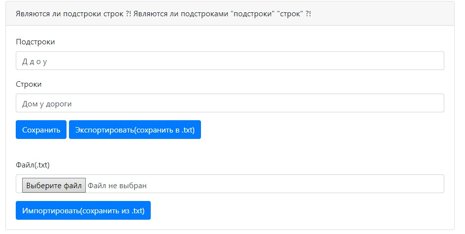
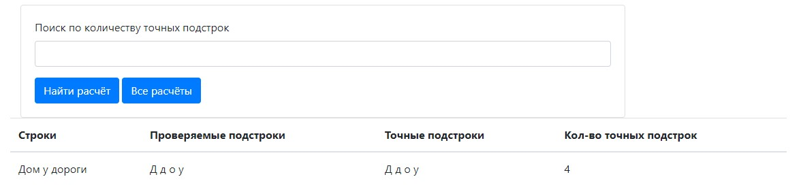
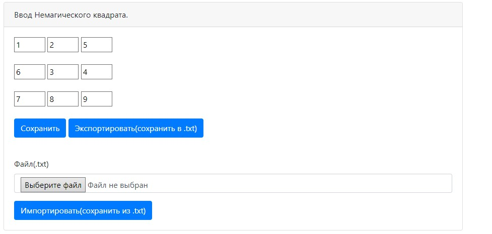
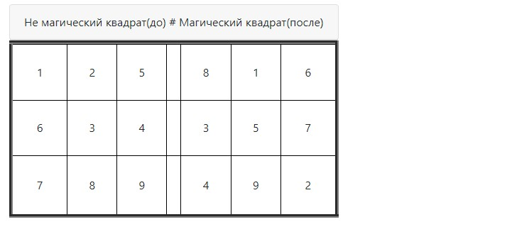
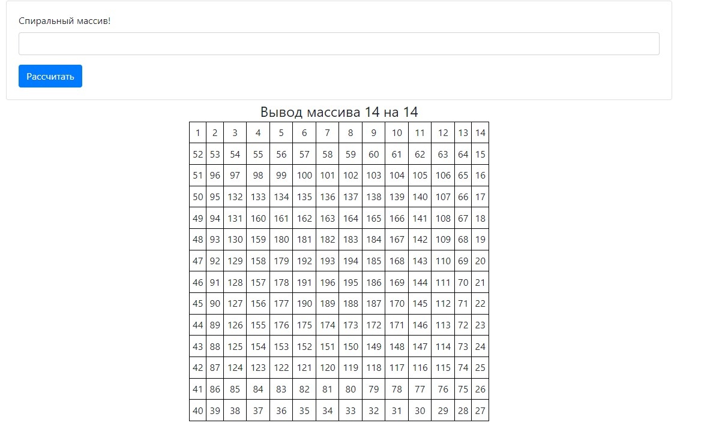

Функционал проекта:
===

1. Сохранить в Базу данных из поля ввода.
2. Экспортировать - записать данные из поля ввода в .txt файл.
3. Загрузить данные из бд и отобразить на странице.
4. Импортировать - прочитать файл .txt и записать в Базу данных.

Первый запуск:
===

1. Создать базу данных в PostgreSQL с именем itService.
2. В файле app.properties в папке resources указать свои username и password для подключения к бд.
3. Выполнить скрипт в базе данных хранящийся в проекте в папке db/scripts/create_01.sql который создаст все нужные для
   проекта таблицы.
4. Запустить метод main из класса Main.

Что может проект:
===

1. Раздел - Расчёт.

- Проверка какие "подстроки" являются подстроками "строк".
  

2. Раздел - Вывод расчётов.

- Вывод расчётов и фильтрация по совпадениям.
  

3. Раздел - Ввод Немагического квадрата.

- Ввод квадрата без повторяющихся цифр от 1 до 9.
  

4. Раздел - Вывод Магического квадрата.

- Преобразованный в Магический квадрат.
  

5. Раздел - Расчёт спиральной матрицы.

- Ввод цифры в пределах от 2 до 50. И вывод на той же странице спиральной матрицы.
  

